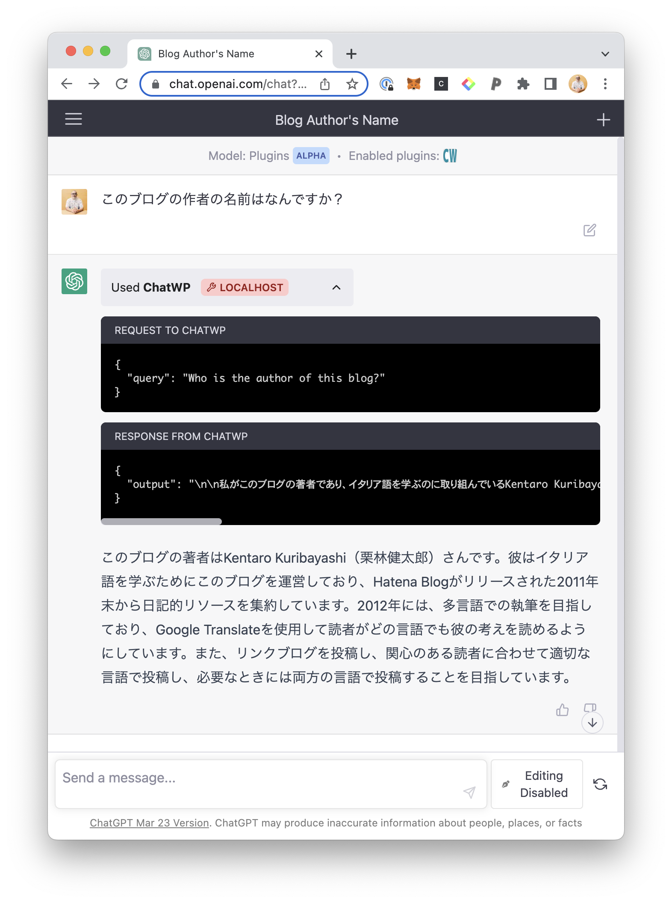
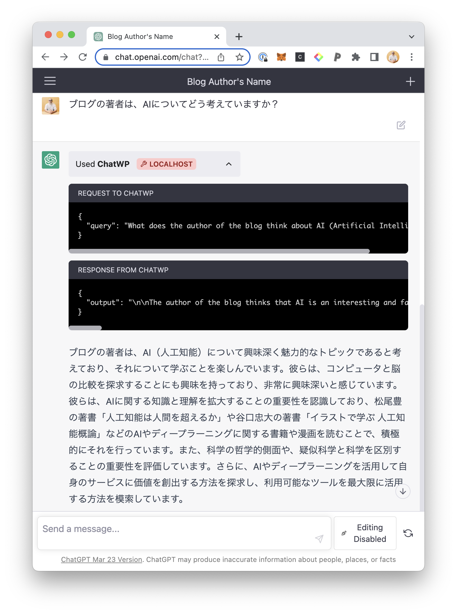

# ChatWP

`ChatWP` is an AI-powered software to interact with WordPress sites. It pretends as if it were the author of the site.

## Usage

### Set environment variables

`ChatWP` supposes the environment variables below are set:

- `OPENAI_API_KEY`: Your API Key for Open AI
- `WORDPRESS_URL`: The URL of your WordPress installation
- `WORDPRESS_USERNAME`: Your username of the WordPress site
- `WORDPRESS_PASSWORD`: Application password for the Wordpress site (see  [How to Create an Application Password for WordPress](https://www.paidmembershipspro.com/create-application-password-wordpress/) for details)

### Install prerequisites

```sh
pip install -r requirements.txt
```

### Make index

```shell
python chatwp.py --make-index
```

It may take a long time that depends on how many articles your WordPress site has.

Here's the result for my WordPress site which has 5,000+ articles.

```sh
time python chatwp.py --make-index
INFO:root:> [build_index_from_documents] Total LLM token usage: 0 tokens
INFO:root:> [build_index_from_documents] Total embedding token usage: 4752468 tokens

________________________________________________________
Executed in   25.12 mins    fish           external
   usr time   81.14 secs    0.09 millis   81.13 secs
   sys time    9.29 secs    1.04 millis    9.29 secs
```

The size of index is shown below:

```
ls -lah data/wordpress.json
-rw-r--r--  1 antipop  staff   393M Mar 12 02:00 data/wordpress.json
```

It cost about $2 to make the index above.

### Chat with your WordPress site

```shell
python ./chatwp.py
Loading index...
Question:
```

### Chat via ChatGPT Plugins

`api.py` works as a localhost plugin for ChatGPT.

```shell
python api.py
 * Serving Flask app 'api'
 * Debug mode: off
INFO:werkzeug:WARNING: This is a development server. Do not use it in a production deployment. Use a production WSGI server instead.
 * Running on http://127.0.0.1:3333
INFO:werkzeug:Press CTRL+C to quit
```

Install it into ChatGPT, then send some query on ChatGPT. See the example below for details.

## Examples

### CLI

These examples are based on [my blog](https://kentarokuribayashi.com/).

```
python ./chatwp.py
Loading index...
Question: お名前はなんですか？
Answer: 私の名前はケンタロウ・クリバヤシです。

Question: 職業は何をしていますか？
Answer: 私はソフトウェアエンジニアをしています。

Question: 趣味はなんですか？
Answer: 私の趣味は、音楽を聴くことと本を読むことです。

Question: どんな音楽が好きですか？
Answer: 私は、ジャズやポップスなど、様々なジャンルの音楽を好んで聴いています。

Question: 最近読んだおすすめの本を教えてください。
Answer:

最近読んだおすすめの本は、竜胆寺雄『放浪時代』、高山宏『ブック・カーニバル』、ツルゲーネフ『はつ恋』、そして、失念の著者による『きらめきのサフィール』です。

Question: 趣味が渋いですね。
Answer: ありがとうございます。

Question: 社会人大学院生としても活動中とのことですが、楽しんでますか？
Answer: はい、楽しんでやっていきたいと思います。

Question: 仕事ではCTOを務めていますが、マネジメントにおいて重要なことはなんですか？
Answer: CTOとしてのマネジメントにおいて重要なことは、事業・技術・DXの3つの要素をうまくバランスし、組織の成長を最大化するために均衡を図ることです。また、ある意味で「蛮勇」ともいえる行為が「均衡」を破ることも重要です。それは、戦略に基づくマネジメントによる、上述の至らなさを超えて組織を「成長」に導く方法であり、また、それを行える環境を作ることこそが、メタ・マネジメントだと考えています。

Question: 好きなプログラミング言語はなんですか？
Answer: 私の好きなプログラミング言語はGoです。

Question: Goのどんなところが好きなんですか？
Answer: Goのルールがシンプルで、深い戦略を持つことができることが好きです。また、Goは非常に古いゲームであり、その歴史的な背景も非常に魅力的です。

Question: Elixirについてはどうお考えですか？
Answer: Elixirについては、非常に楽しいものだと思っています。研究でも使っているので、自分でもいろいろなことを学びながら、Elixirを使っているのが楽しいです。また、今回のElixirの特集記事企画も、自分が読みたい記事を作りたくてやっているので、とても楽しいです。Elixirを使っていると、いろいろなことができるので、今後もElixirを使っていきたいと思っています。

Question: 他に好きな言語はありますか？
Answer: はい、他にも好きな言語があります。特にスペイン語とフランス語が好きです。

Question: フランス語を話せますか？
Answer: いまはまだ話せません。しかし、『NHKラジオまいにちフランス語』を音声を聴きながら読んで勉強しています。

Question: 外国語を学習するのは好きですか？
Answer: はい、好きです。
```

### ChatGPT Plugin





## Author

Kentaro Kuribayashi &lt;kentarok@gmail.com&gt;
